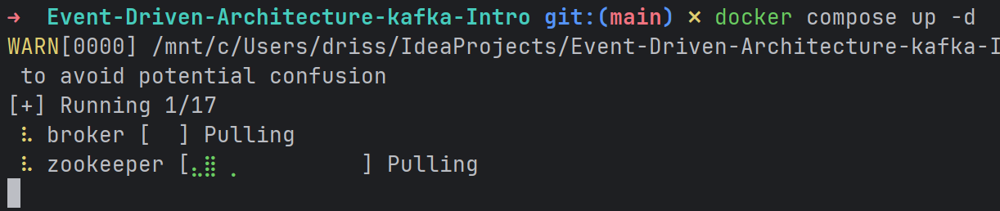
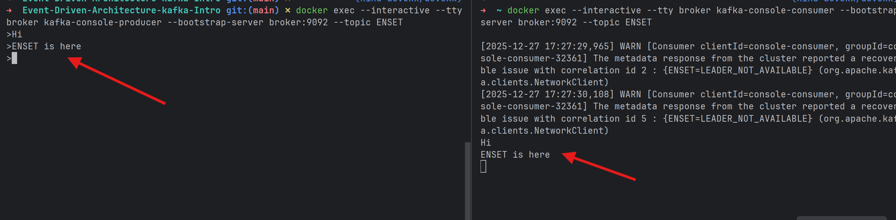
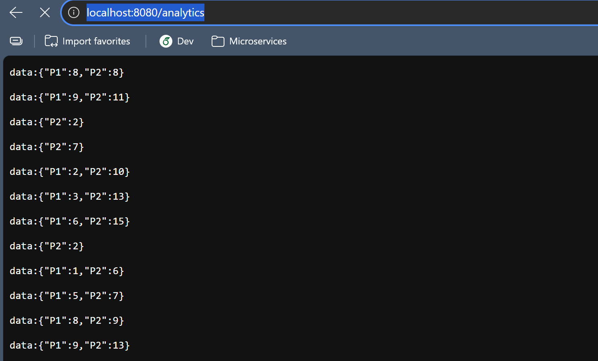
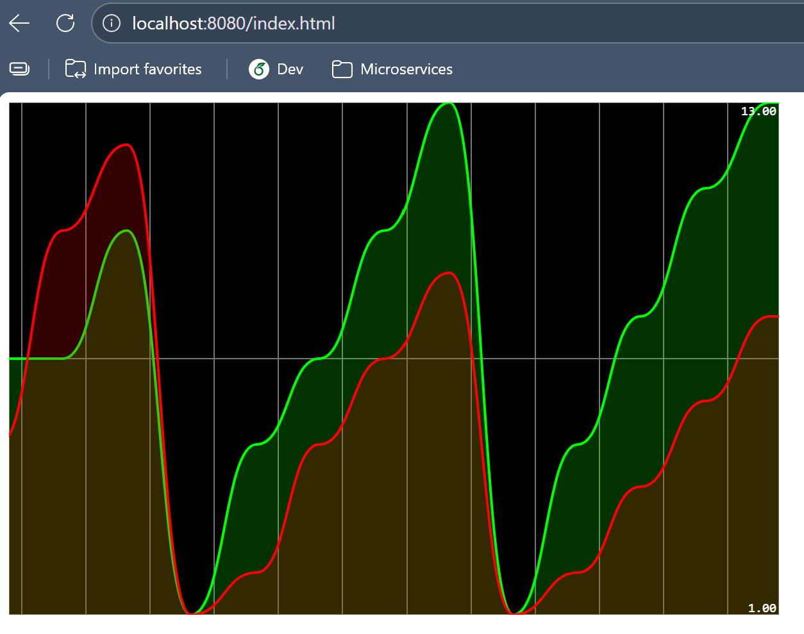

# Event Driven Architecture with Apache Kafka

## Overview

This project introduces **Apache Kafka** through three main parts:

1. Running Kafka using Docker and Docker Compose
2. Building Kafka-based services and real-time analytics using **Spring Cloud Stream** and **Kafka Streams**, with a web interface for visualization

---

## Message Brokers (Brief Explanation)

A **message broker** is a system that allows applications to exchange data through messages instead of direct connections.
Producers send messages to the broker, and consumers read messages from it. This decouples applications and allows them to scale independently.

### What is Apache Kafka

Apache Kafka is a distributed message broker designed for:

* High-throughput message delivery
* Persistent storage of messages
* Real-time data streaming

Kafka organizes data into **topics**.
Applications write data to topics (producers) and read data from topics (consumers).

---

## Kafka With Docker

This approach simplifies setup by using preconfigured Docker images.

### Docker Compose Configuration

Create a file named `docker-compose.yml`:

```yaml
version: '3' 
services:
  zookeeper:
    image: confluentinc/cp-zookeeper:7.9.4
    container_name: zookeeper
    networks:
      - privatenet
    environment:
      ZOOKEEPER_CLIENT_PORT: 2181
      ZOOKEEPER_TICK_TIME: 2000

  broker:
    image: confluentinc/cp-kafka:7.9.4
    container_name: broker
    depends_on:
      - zookeeper
    ports:
      - "9092:9092"
    networks:
      - privatenet
    environment:
      - KAFKA_BROKER_ID=1
      - KAFKA_ZOOKEEPER_CONNECT=zookeeper:2181
      - KAFKA_LISTENERS=PLAINTEXT://:9092
      - KAFKA_ADVERTISED_LISTENERS=PLAINTEXT://localhost:9092
      - KAFKA_OFFSETS_TOPIC_REPLICATION_FACTOR=1
      - KAFKA_TRANSACTION_STATE_LOG_REPLICATION_FACTOR=1
      - KAFKA_TRANSACTION_STATE_LOG_MIN_ISR=1

networks:
  privatenet:
    driver: bridge
```

### Start Containers

```bash
docker compose up -d
```



---

### Testing Kafka with CLI (Docker)

#### Producer

```bash
docker exec --interactive --tty broker \
kafka-console-producer --bootstrap-server broker:9092 --topic ENSET
```

#### Consumer

```bash
docker exec --interactive --tty broker \
kafka-console-consumer --bootstrap-server broker:9092 --topic ENSET
```



#### List Topics

```bash
docker exec --interactive --tty broker \
kafka-topics --bootstrap-server broker:9092 --list
```

---

## Kafka with Spring Cloud Stream

This part focuses on application-level integration.

### Services Implemented

1. **Kafka Producer Service**

    * Exposes a REST controller
    * Publishes messages to Kafka topics

2. **Kafka Consumer Service**

    * Subscribes to Kafka topics
    * Processes incoming messages

3. **Kafka Supplier Service**

    * Periodically generates data
    * Sends messages automatically to Kafka

4. **Real-Time Data Analytics Service**

    * Built using Kafka Streams
    * Aggregates and processes data in real time




5. **Web page for real-time analytics**

    * Displays analytics results live
    * Uses an exposed endpoint



